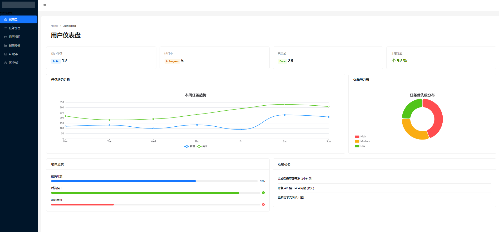
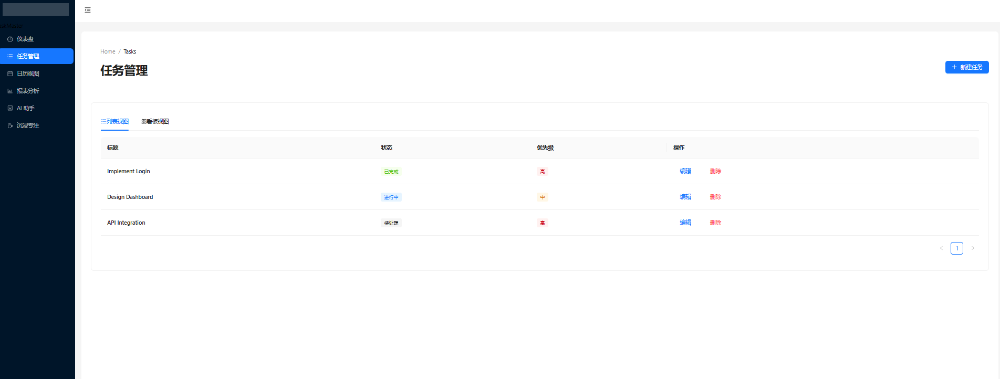
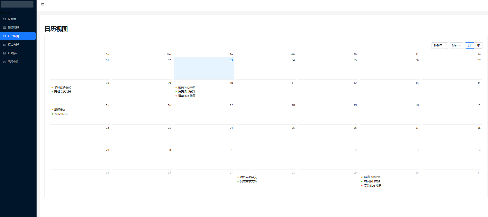
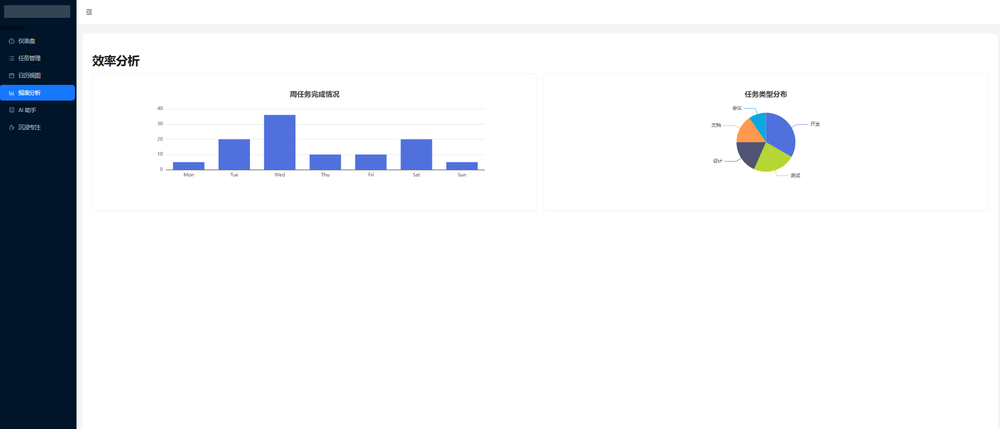
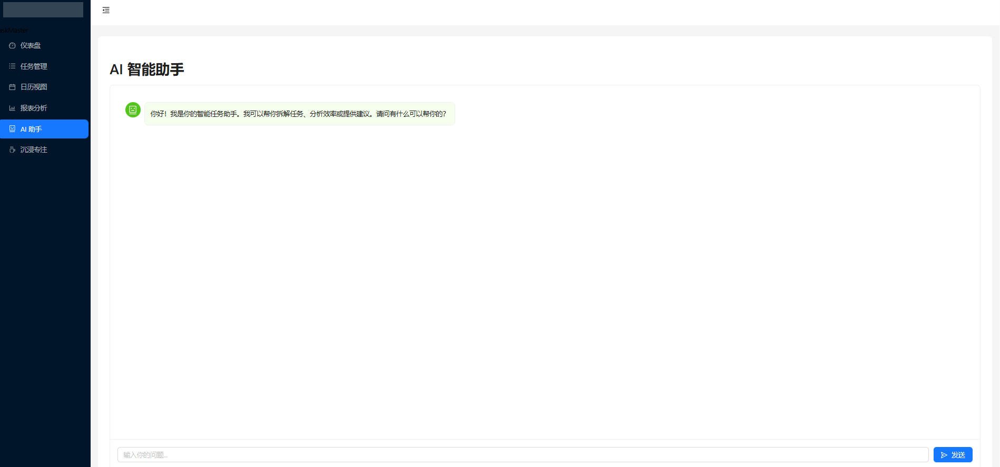

# Task Master 项目开发文档

本文档旨在为开发团队提供完整的项目指南，涵盖技术架构、开发规范、目录结构及核心模块说明。

## 1. 项目概述

Task Master 是一个基于 React 和 TypeScript 的现代化任务管理协作平台，旨在通过直观的界面和智能化的功能提升个人与团队的工作效率。

### 核心功能与演示

#### 1.1 仪表盘 (Dashboard)

实时概览任务状态、优先级分布及效率统计，帮助用户快速掌握工作全貌。


#### 1.2 任务管理 (Task Management)

灵活的任务创建、分配与追踪，支持列表视图与看板视图切换。


#### 1.3 日历视图 (Calendar View)

基于时间轴的任务规划，直观展示每日、每周的任务安排。


#### 1.4 效率分析 (Efficiency Reports)

可视化的数据报表，多维度分析个人与团队的工作效率与产出。


#### 1.5 AI 助手 (AI Assistant)

智能化的任务建议与辅助，提供自动化任务拆解与进度预测。


#### 1.6 沉浸专注 (Immersive Mode)

全屏专注模式与白噪音背景，帮助用户排除干扰，提升专注力。


## 2. 技术架构

本项目采用业界主流的 React 技术栈，确保高性能与可维护性。

- **核心框架**: React 18 + TypeScript 5
- **构建工具**: Create React App (CRA) + Craco (配置覆盖)
- **路由管理**: React Router DOM v6.4+ (Data Router)
- **状态管理**: Redux Toolkit + React Redux
- **UI 组件库**: Ant Design 5.x
- **样式方案**: SCSS Modules + Global SCSS
- **HTTP 请求**: Axios (封装拦截器)
- **图表库**: ECharts
- **工具库**: Lucide React (图标), Dayjs (时间处理)

## 3. 开发规范

### 3.1 文件命名

- **组件文件**: 使用 PascalCase，如 `TaskItem.tsx` 或 `TaskItem/index.tsx`。
- **工具函数**: 使用 camelCase，如 `formatDate.ts`。
- **常量文件**: 使用 SCREAMING_SNAKE_CASE 或 camelCase，如 `constants.ts`。
- **样式文件**: 对应组件名，如 `TaskItem.module.scss`。

### 3.2 代码规范

- **TypeScript**: 严格模式，避免使用 `any`，定义清晰的 Interface/Type。
- **React**: 优先使用 Functional Components 和 Hooks。
- **注释**: 复杂逻辑需添加注释，公共组件需添加 Props 说明。

### 3.3 Git 提交规范

遵循 Conventional Commits 规范：

- `feat`: 新功能
- `fix`: 修复 Bug
- `docs`: 文档变更
- `style`: 代码格式调整（不影响逻辑）
- `refactor`: 代码重构
- `perf`: 性能优化
- `test`: 测试相关
- `chore`: 构建过程或辅助工具变动

示例: `feat: add task filtering logic`

## 4. 目录结构说明

```
src/
├── api/                # 接口定义层
├── assets/             # 静态资源 (图片、字体等)
├── components/         # 组件层
│   ├── common/         # 通用基础组件
│   └── business/       # 业务专用组件
├── hooks/              # 自定义 Hooks
├── layouts/            # 布局组件 (MainLayout 等)
├── pages/              # 页面组件 (路由级)
├── router/             # 路由配置
├── stores/             # Redux 状态管理
├── styles/             # 全局样式
├── types/              # TypeScript 类型定义
├── utils/              # 工具函数
├── App.tsx             # 根组件
└── index.tsx           # 入口文件
```

## 5. 环境变量说明

项目支持多环境配置，通过 `.env` 文件管理：

- `.env`: 通用配置
- `.env.development`: 开发环境配置
- `.env.production`: 生产环境配置

主要变量：

```bash
REACT_APP_API_BASE_URL=/api  # API 基础路径
PORT=3000                    # 开发服务器端口
```

## 6. 接口请求封装说明

网络请求模块位于 `src/utils/request.ts`，基于 Axios 进行封装。

### 特性

- **请求拦截**: 自动携带 `Authorization` Token。
- **响应拦截**: 统一处理 HTTP 错误和业务错误码。
- **类型支持**: 提供泛型接口，确保响应数据类型安全。

### 使用示例

```typescript
import { http } from "@/utils/request";
import { Task } from "@/types/task";

// GET 请求
const getTasks = (params: any) => http.get<Task[]>("/tasks", params);

// POST 请求
const createTask = (data: Partial<Task>) => http.post<Task>("/tasks", data);
```

## 7. 路由使用说明

路由配置位于 `src/router` 目录，采用配置式路由。

- **index.tsx**: 路由入口，合并 `basicRoutes` 和 `layoutRoutes`。
- **layoutRoutes.tsx**: 定义页面路由及其元数据 (Meta)。

### 路由元数据 (RouteMeta)

```typescript
interface RouteMeta {
  title?: string; // 页面标题/菜单名称
  icon?: ReactNode; // 菜单图标
  requiresAuth?: boolean; // 是否需要登录权限
  hideInMenu?: boolean; // 是否在侧边栏隐藏
}
```

### 新增页面步骤

1. 在 `src/pages` 创建页面组件。
2. 在 `src/router/layoutRoutes.tsx` 的 `mainRoutes` 数组中添加配置。
3. 侧边栏菜单将根据 Meta 配置自动生成。

## 8. 状态管理说明

采用 Redux Toolkit 进行全局状态管理，位于 `src/stores`。

- **Store**: `src/stores/index.ts` 配置主 Store。
- **Modules**: `src/stores/modules/*.ts` 定义 Slice (Reducer + Actions)。

### 使用示例

```typescript
import { useAppDispatch, useAppSelector } from "@/hooks/store";
import { fetchTasks } from "@/stores/modules/taskSlice";

const Component = () => {
  const dispatch = useAppDispatch();
  const tasks = useAppSelector((state) => state.tasks.list);

  useEffect(() => {
    dispatch(fetchTasks());
  }, [dispatch]);
};
```

## 9. 通用组件说明

通用组件位于 `src/components/common`。详细使用文档请参考 [组件文档](./component.md)。

常用组件：

- **AuthRoute**: 路由权限守卫。
- **ErrorBoundary**: 全局错误边界。
- **PageHeader**: 统一页面头部。
- **StatCard**: 统计卡片组件。

## 10. 构建与部署

### 开发环境

```bash
npm start
# 访问 http://localhost:3000
```

### 生产构建

```bash
npm run build
```

构建产物将输出到 `build/` 目录，可部署至 Nginx 或任何静态资源服务器。

## 11. 常见问题

### Q1: 依赖安装失败？

尝试使用 `npm install --legacy-peer-deps` 忽略版本冲突。

### Q2: 接口请求 401？

请检查 LocalStorage 中是否存有有效的 Token，或重新登录。

### Q3: 样式不生效？

项目使用了 SCSS Modules，请确保文件名为 `*.module.scss` 并通过 import 引入。
